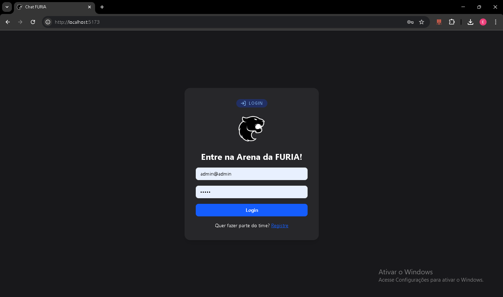
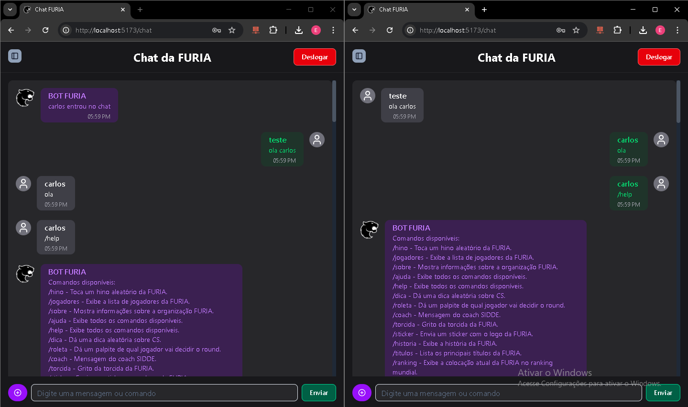
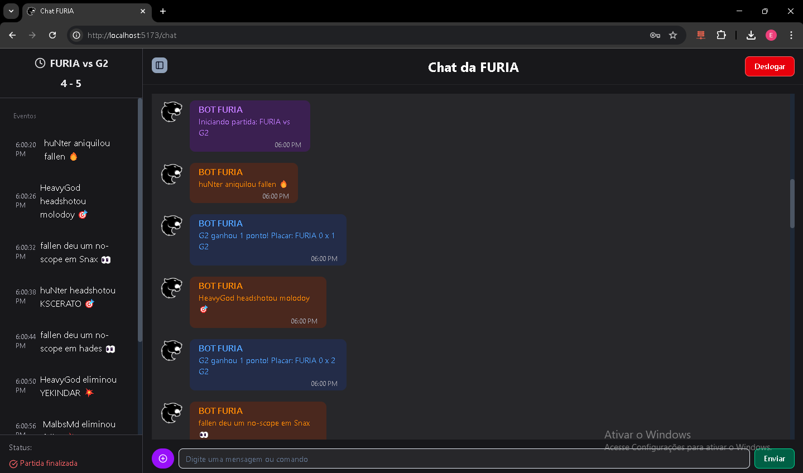
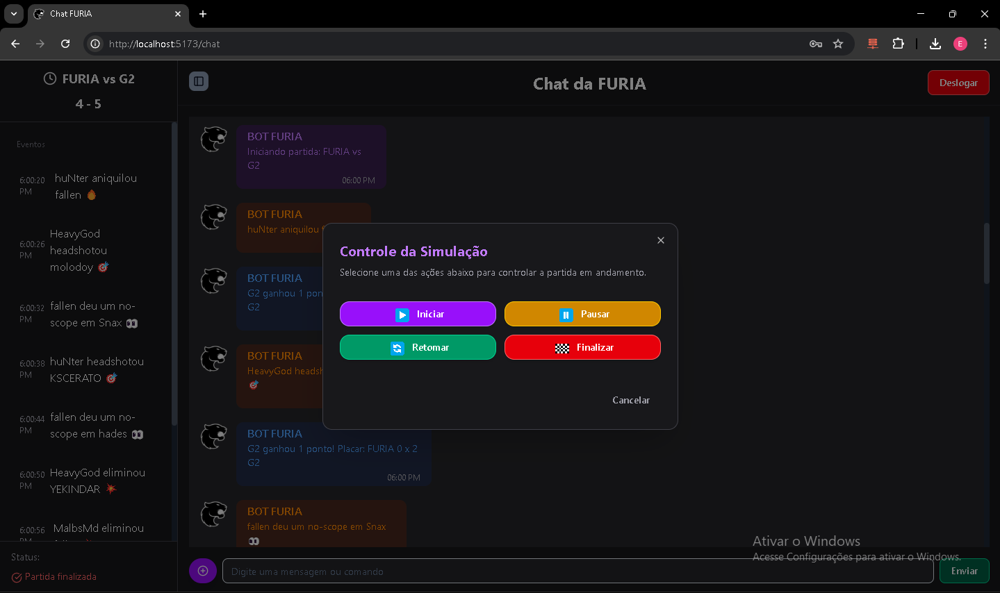

# Chat FURIA - Aplicação Fullstack

Bem-vindo ao **Chat FURIA**, uma aplicação fullstack de chat ao vivo desenvolvida para o teste técnico da empresa **FURIA**.  
Essa aplicação permite a comunicação entre usuários autenticados em tempo real, integração com bot por comandos e simulação interativa de partidas com eventos dinâmicos como kills e pontuações!

---

## 🚀 Funcionalidades

- 💬 **Chat em tempo real** entre usuários
- 🤖 Comandos interativos para o bot, por exemplo:
  - `/torcida` – mostra o apoio da torcida
  - `/coach` – mensagem do coach para o chat
  - `/jogadores` – lista os jogadores
  - `/help` – mostra todos os comandos disponíveis
- 🎮 **Simulação de partidas ao vivo**, com:
  - Eventos como kills, pontuações e vitórias
  - Controles para iniciar, pausar, retomar e finalizar
- 🌐 Requisições HTTP para controle da simulação
- 🔌 Comunicação via WebSocket para mensagens e eventos em tempo real

---

## 📦 Tecnologias Utilizadas

- **Frontend**: Vite + React + TailwindCSS
- **Backend**: Node.js + Express + WebSocket (Socket.IO)
- **Banco de Dados**: MongoDB

---

## 🛠 Como rodar o projeto

### ⚙️ Opção 1: Com Docker Compose

> Pré-requisitos: Docker

#### 1. Clone o repositório

Primeiro, faça um clone do repositório:

```bash
git clone https://github.com/CarlosSerafimm/chat-furia.git
cd chat-furia
```

Depois rode o seguinte comando:

```bash
docker-compose up --build
```

- Frontend: [http://localhost:5173](http://localhost:5173)
- Backend: [http://localhost:3000](http://localhost:3000)

#### 2. Clone o repositório

### 🖥️ Opção 2: Manualmente (sem Docker)

> Pré-requisitos: Node.js 22, MongoDB

#### Backend

```bash
cd chat-furia/backend
#configure config/db.js com as credenciais do banco
npm install
node start
```

- Backend: [http://localhost:3000](http://localhost:3000)

#### Frontend

```bash
cd chat-furia/backend
npm install
npm run dev
```

- Frontend: [http://localhost:5173](http://localhost:5173)

---

## 🧭 API - Endpoints disponíveis

### 📡 HTTP (REST)

| Método | Endpoint               | Descrição                         |
| ------ | ---------------------- | --------------------------------- |
| `POST` | `/register`            | Registra um usuário               |
| `POST` | `/iniciar-simulacao`   | Inicia a simulação de uma partida |
| `POST` | `/pausar-simulacao`    | Pausa a simulação atual           |
| `POST` | `/retomar-simulacao`   | Retoma a simulação pausada        |
| `POST` | `/finalizar-simulacao` | Finaliza a simulação              |

---

## 🔌 WebSocket Endpoints

### 📥 Eventos recebidos do cliente

| Evento        | Payload                             | Descrição                                            |
| ------------- | ----------------------------------- | ---------------------------------------------------- |
| `login`       | `{ username, password }` + callback | Realiza o login do usuário e autentica via WebSocket |
| `chatMessage` | `msg: string`                       | Envia uma mensagem no chat (texto ou comando)        |

### 📤 Eventos enviados para o cliente

| Evento         | Payload                                 | Descrição                                                               |
| -------------- | --------------------------------------- | ----------------------------------------------------------------------- |
| `message`      | `{ sender, message, type, timestamp }`  | Mensagem enviada pelo usuário ou pelo BOT (texto, evento, placar, etc.) |
| `game-update`  | `{ teams, score, status, events? }`     | Atualiza o estado geral da partida (em_andamento, pausada, finalizada)  |
| `score-update` | `{ FURIA: number, [oponente]: number }` | Atualiza apenas o placar da partida                                     |

### 🧠 Comandos disponíveis no chat

| Comando             | Descrição                                                    |
| ------------------- | ------------------------------------------------------------ |
| `/hino`             | Toca um hino aleatório da FURIA.                             |
| `/jogadores`        | Exibe a lista de jogadores da FURIA.                         |
| `/sobre`            | Mostra informações sobre a organização FURIA.                |
| `/ajuda` ou `/help` | Exibe todos os comandos disponíveis.                         |
| `/dica`             | Dá uma dica aleatória sobre CS.                              |
| `/roleta`           | Dá um palpite de qual jogador vai decidir o round.           |
| `/coach`            | Mensagem do coach SIDDE.                                     |
| `/torcida`          | Grito da torcida da FURIA.                                   |
| `/sticker`          | Envia um sticker com o logo da FURIA.                        |
| `/historia`         | Exibe a história da FURIA.                                   |
| `/titulos`          | Lista os principais títulos da FURIA.                        |
| `/ranking`          | Exibe a colocação atual da FURIA no ranking mundial.         |
| `/proximo-jogo`     | Exibe informações sobre o próximo jogo da FURIA.             |
| `/jogo-anterior`    | Exibe informações sobre o jogo anterior da FURIA.            |
| `/placar`           | Exibe o placar do jogo que está em andamento.                |
| `/rounds`           | Exibe quantos rounds faltam no máximo para acabar a partida. |

## 🌟 Como interagir no Chat

- Para enviar mensagens, basta digitar no campo de texto.
- Para interagir com o bot, digite um dos comandos no chat, como:
  - /torcida – Ver a torcida apoiando sua equipe.
  - /coach – receber uma mensagem do técnico da equipe.
  - /jogadores – Listar os jogadores.
  - /placar - Receber do placar da partida ao vivo
  - /torcida – Ver a torcida apoiando sua equipe.
  - /help - Para ver todos os comandos disponiveis

## 📸 Imagens da Aplicação

> Algumas telas da interface do Chat FURIA:


-

-

-


## 📄 Desenvolvido por:

### Carlos Serafim

[Linkedin](https://www.linkedin.com/in/carlos-serafim-951049306/)
